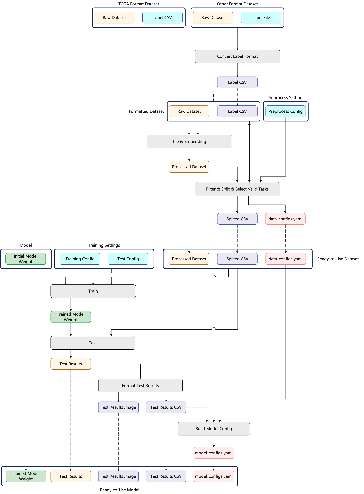

# WSI Benchmark Pipeline
> Notice: some content of this file is not up-to-date, please await the release of our most recent version!

Version: Dec 19th 2024

This doc states how we process & run a WSI benchmark from scratch.

## **1. Overall Pipeline**



## **2. Important Paths (for PuzzleAI Cluster)**

### **Raw Datasets**
- **Raw Dataset**: `/data/hdd_1/CPIA/`
- **Raw Dataset Labels** (from cbioportal): `/data/hdd_1/CPIA_label/cbioportal/`

---

### **Processed Datasets**
- **Processed Datasets (SSD)**: `/data/ssd_1/WSI/`
  - **Tiled Dataset**: `/data/ssd_1/WSI/DATASET_NAME/tiles-datasets`  
    *Contains billions of small tile images. Not used unless embedding.*
  - **Embedded Dataset**: `/data/ssd_1/WSI/DATASET_NAME/tiles-embeddings`
  
- **Processed Datasets (HDD)**: `/data/hdd_1/BigModel/`  
  *HDD is slower; prefer SSD for faster processing.*

---

### **Results**
- **Model Running Results**: `/data/private/`
  - **Running Results**: `/data/private/BigModel/runs_DATASET_NAME/`  
    *Each subfolder represents a single experiment.*

---

## **3. Prepare Embedded Datasets**

*Normally we could skip these steps as we will make embedded dataset in advance.*

Before we start, we need to choose our embedding model, it will determine the shape of your embedded dataset and impact the performance of downstream tasks. You can check the embedded feature dimension for each model below:

| Model        | Output Shape        |
|--------------|---------------------|
| ResNet18     | torch.Size([1, 512]) |
| ResNet34     | torch.Size([1, 512]) |
| ResNet50     | torch.Size([1, 2048])|
| ResNet101    | torch.Size([1, 2048])|
| CONCH        | torch.Size([1, 512]) |
| VPT          | torch.Size([1, 768]) |
| UNI          | torch.Size([1, 1024])|
| MUSK         | torch.Size([1, 1024])|
| gigapath     | torch.Size([1, 1536])|
| Virchow1     | torch.Size([1, 2560])|
| Virchow2     | torch.Size([1, 2560])|

For tile & embedding, we do the following process:
```bash
# Tile the datasets
python -u DataPipe/Build_tiles_dataset.py \
    --WSI_dataset_path /data/hdd_1/CPIA/DATASET_NAME \
    --tiled_WSI_dataset_path /data/ssd_1/WSI/DATASET_NAME/tiles-datasets \
    --edge_size EDGE_SIZE \
    --target_mpp 0.5

# Embed the datasets
python -u DataPipe/Build_embedded_dataset.py \
    --WSI_dataset_path /data/ssd_1/WSI/DATASET_NAME/tiles-datasets \
    --embedded_WSI_dataset_path /data/ssd_1/WSI/DATASET_NAME/tiles-embeddings \
    --model_name MODEL_NAME \
    --model_weight_path /data/hdd_1/model_weights/MODEL_NAME_tile_encoder.pt \
    --edge_size EDGE_SIZE \
    --PrefetchDataLoader_num_workers 32 \
    --batch_size BATCH_SIZE
```
Under `BigModel/DataPipe/scripts_preprocess` there are two files: `init_scripts.py` and `template_tile_and_embed_tcga.sh`. You will find definition and description of each config parameters there. By alter and running `init_scripts.py` you will make a series of scripts to automatically crop and embed the TCGA datasets.

## **4. Split Dataset**

For TCGA datasets, assume your dataset name is `DATASET_NAME`, you may run the following commands to filter and split the dataset:

```bash
cd BigModel/DataPipe

python Slide_dataset_tools.py \
    --root_path /data/ssd_1/WSI/TCGA-DATASET_NAME/tiles-embeddings/ \
    --task_description_csv /data/hdd_1/CPIA_label/cbioportal/TCGA-DATASET_NAME_clinical_data.csv \
    --subject_key patientId \
    --sample_key slide_id \
    --split_target_key fold_information \
    --task_setting_folder_name task-settings-5folds \
    --mode TCGA \
    --dataset_name DATASET_NAME \
    --fix_random_seed \
    --k 5
```
For other datasets, you need to find or manually prepare a csv file and run `Slide_dataset_tools.py`. Use PANDA dataset as an example:

```bash
cd BigModel/DataPipe

python Slide_dataset_tools.py \
    --root_path /data/ssd_1/WSI/PANDA/tiles-embeddings/ \
    --task_description_csv /data/ssd_1/WSI_label/PANDA_train.csv \
    --subject_key image_id \
    --sample_key image_id \
    --split_target_key fold_information \
    --task_setting_folder_name task-settings-5folds \
    --mode basic \
    --dataset_name panda \
    --tasks_to_run "isup_grade%gleason_score" \
    --fix_random_seed \
    --k 5
```


The output is located under `/data/ssd_1/WSI/DATASET_NAME/tiles-embeddings/task-settings-5folds/`, it contains:
- The filtered csv label containing train/val/test split info: `task_description.csv`
- The dataset config info: `task_config.yaml`

These two files are essential for further steps.

## **5. Analyze Dataset**

Before proceeding, it's essential to analyze the dataset.

### **Steps for Dataset Analysis**
1. **Locate the Analysis Code:**  
   The dataset analysis code is located in:  
   `BigModel/DataPipe/dataset_analyse/`

2. **Modify Analysis Script:**  
   - Edit `dataset_analyse/tools/analyse_datasets.py`.
   - Add a new analysis function specific to your dataset. For example, you could create a function like `analyse_DATASET_NAME`.

3. **Run the Analysis Script:**  
   - Execute `dataset_analyse/main.py`.
   - The analysis results will be saved in:  
     `dataset_analyse/results/`

4. **Interpret Results:**  
   - Use the analysis results to determine which tasks to run.  
   - Select tasks that are:
     - Clinically meaningful.
     - Roughly balanced among the classes.


## **6. Run Benchmark Pipeline**

1. **Locate Pipeline Scripts:**  
   The pipeline scripts are in:  
   `BigModel/DownStream/WSI_finetune/scripts_exp/`

2. **Generate Scripts:**  
   - Generate scripst based on your dataset settings, given an example:
      ```bash
      # TCGA-lung
      python init_scripts.py \
        --template_path "template_script.sh" \
        --output_name "tcga-lung" \
        --gpu_list "0%1" \
        --dataset "TCGA-lung" \
        --csv_fname "task_description_tcga-lung_reduced_20241203.csv" \
        --fold_range 1 \
        --model_names "SlideAve%ABMIL%DSMIL%CLAM%LongNet%TransMIL%SlideViT" \
        --tasks "AJCC_PATHOLOGIC_TUMOR_STAGE_reduced%FEV1_PERCENT_REF_POSTBRONCHOLIATOR%lung-cancer-subtyping%OS_MONTHS" \
        --lr_range "1e-6%1e-5%1e-4" \
        --roi_feature_dim 1536 \
        --max_tiles 2000 \
        --batch_size 4 \
        --num_workers 64 \
        --num_epochs 100 \
        --warmup_epochs 20 \
        --intake_epochs 50 \
        --slide_id_key "slide_id"
      ```
   - The scripts will be generated in:
     - `DATASET_NAME_stl/` (single-task learning).
     - `DATASET_NAME_mtl/` (multi-task learning).  

3. **Run Benchmark Experiments:**  
   - Navigate to `DATASET_NAME_stl/` and locate scripts like `run_all_scripts_gpu_n`, where `n` is the GPU index.
   - Simultaneously run all `run_all_scripts_gpu_n` scripts:  
     ```bash
     bash run_all_scripts_gpu_n.sh
     ```


## **7. Gather Results**

1. **Locate Results**
  - The results will be saved in: `/data/private/BigModel/runs_DATASET_NAME`
  - Under each subfolder, locate: `Test/WSI_task_results.csv`
  - This file contains the test accuracy or correlation metrics for the experiment.

2. **Gather Results for Entire Dataset**
  - Run `retrieve_csv.py`, given an example:
    ```bash
    python retrieve_csv.py \
          --runs_path /data/private/BigModel/runs_TCGA-UCEC \
          --output_path results_ucec \
          --task_name_complete GRADE OS_MONTHS HISTOLOGICAL_DIAGNOSIS TUMOR_INVASION_PERCENT
    ```


---
# Additional Functions

1. Run slide level embedding to make probing dataset

```Shell
python DataPipe/Build_slide_probing_dataset.py \
    --model_name gigapath \
    --slide_embedding_folder /data/hdd_1/BigModel/TCGA-BRCA/Slide_embeddings/gigapath \
    --tile_embedding_path /data/hdd_1/BigModel/TCGA-BRCA/Tile_embeddings/gigapath \
    --num_workers 8
```

2. Run WSI level SSL pretraining

```Shell
# currently DP (not recomended) future DDP in development
python WSI_VisionSSL_training.py --output_dir /data/hdd_1/BigModel/runs --log_dir /data/hdd_1/BigModel/runs --tile_embedding_path /data/hdd_1/BigModel/TCGA-LUAD-LUSC/Tile_embeddings/gigapath --SSL_name MAE --model_name gigapath --max_tiles 5000 --ROI_feature_dim 1536 --epochs 200
```

3. Run WSI level VQA-tuning after pretraining

```Shell
# todo
```

4. Run WSI level VQA application

```Shell
# todo
```
