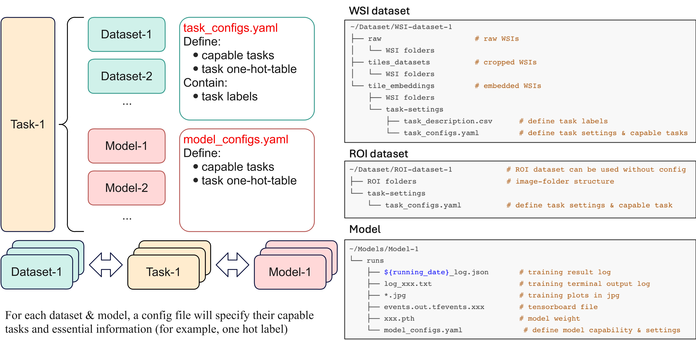

# Dataset Design

Version: Feb 12th 2025

We use an unified dataset and model weight storage structure as follow:


Here is a typical dataset structure:
```
/data/BigModel/TCGA-demoset
├── TCGA-demo_clinical_data.csv
├── raw
│   ├── WSI folders
│   └── ...
├── tiles-datasets
│   ├── WSI tiled folders
│   ├── ...
│   ├── dataset.csv
│   ├── thumbnails
│   └── wsi_tile_processing.log
└── tiles-embeddings (or embedding name)
    ├── WSI embedded folders
    ├── ...
    ├── wsi_tile_embedding.log
    └── task-settings-5folds
        ├── task_config.yaml
        └── task_description.csv
```

The demo TCGA dataset is available [here](https://drive.google.com/file/d/1Xp_35nnWd9iILNlUQcOb7dbRLooDfZ7U/view?usp=share_link).


