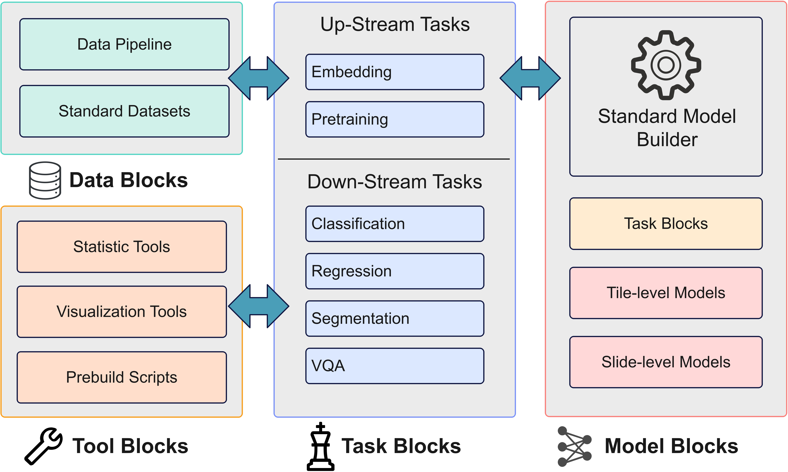

# UnPuzzle: A Unified Framework for Pathology Image Analysis

## Introduction

<div style="text-align: center;">
  
</div>

UnPuzzle is an open-source pathology AI research pipeline. It provides a modular pipeline encompassing data pre-processing, model deployment, and task configuration, enabling efficient benchmarking across Whole Slide Images (WSIs) and Region of Interest (ROI) tasks. The framework supports various learning paradigms, including self-supervised learning, multi-task learning, and multi-modal learning, facilitating comprehensive pathology AI development.

The licenses for the imported code follows their original source.

## Version History

- 2025.2.13: Initial Release

## Quick Start for WSI Models

Environment: Ubuntu server, using NVIDIA H100 GPU with CUDA toolkit enabled

Dataset: TCGA-BRCA dataset from GDC.

> For detailed tutorial, please refer to [ROI benchmark doc](./Docs/ROI_benchmark_pipeline.md) and [WSI benchmark doc](./Docs/WSI_benchmark_pipeline.md).

> For detailed dataset design, please refer to [dataset_design.md](./Docs/dataset_design.md)

1. Download our repository and go into our project directory

```
git clone https://github.com/sagizty/BigModel.git
cd BigModel
```

2. Install dependencies

```Shell
conda env create -f environment.yaml
conda activate BigModel
pip install -r requirements.txt
```

3. Building dataset

<div style="text-align: center;">
  
</div>

   (a) Dataset building (Tile cropping)
```Shell
python -u DataPipe/Build_tiles_dataset.py \
    --WSI_dataset_path /data/hdd_1/DevDatasets/WSI/TCGA-BRCA \
    --tiled_WSI_dataset_path /data/ssd_1/WSI/TCGA-BRCA/tiles-datasets \
    --edge_size 224 \
    --mode TCGA \
    --target_mpp 0.5
```

   (b) Dataset building (Tile Embedding)

```Shell
# you need to specify --model_weight_path if you cannot download weight from web.
python -u DataPipe/Build_embedded_dataset.py \
    --WSI_dataset_path /data/ssd_1/WSI/TCGA-BRCA/tiles-datasets \
    --embedded_WSI_dataset_path /data/ssd_1/WSI/TCGA-BRCA/tiles-embeddings \
    --model_name gigapath \
    --edge_size 224 \
    --PrefetchDataLoader_num_workers 32 \
    --batch_size 2048 \
    --target_mpp 0.5
```

To use local model weight (for example, you do not have network access or you wish to apply post-tuning), you may specify `--model_weight_path`:

```Shell
python -u DataPipe/Build_embedded_dataset.py \
    --WSI_dataset_path /data/ssd_1/WSI/TCGA-BRCA/tiles-datasets \
    --embedded_WSI_dataset_path /data/ssd_1/WSI/TCGA-BRCA/tiles-embeddings \
    --model_name gigapath \
    --model_weight_path /data/hdd_1/model_weights/gigapath_tile_encoder.pt \
    --edge_size 224 \
    --PrefetchDataLoader_num_workers 32 \
    --batch_size 2048 \
    --target_mpp 0.5
```

4. Build MTL dataset and task configs for downstram MTL tasks

```Shell
cd DataPipe
python Slide_dataset_tools.py \
    --root_path /data/ssd_1/WSI/TCGA-BRCA/tiles-embeddings/ \
    --task_description_csv /data/ssd_1/WSI_label/TCGA-BRCA.csv \
    --subject_key image_id \
    --sample_key image_id \
    --split_target_key fold_information \
    --task_setting_folder_name task-settings-5folds \
    --mode basic \
    --dataset_name TCGA-BRCA \
    --tasks_to_run "isup_grade%gleason_score" \
    --fix_random_seed \
    --cls_task isup_grade \
    --k 5
```

5. Run MTL task with WSI MTL framework

```Shell
# Train
python -u MTL_Train.py \
    --model_name ABMIL \
    --tag tcga_brca_mtl \
    --data_path /data/ssd_1/WSI/TCGA-BRCA/tiles-embeddings \
    --ROI_feature_dim 1536 \
    --runs_path /data/private/BigModel/runs_TCGA-BRCA \
    --enable_tensorboard \
    --task_description_csv /data/ssd_1/WSI/TCGA-BRCA/tiles-embeddings/task-settings-5folds/task_description.csv \
    --task_setting_folder_name task-settings-5folds \
    --slide_id_key slide_id \
    --split_target_key fold_information_5fold-1 \
    --max_tiles 2000 \
    --batch_size 1 \
    --num_workers 64 \
    --num_epochs 100 \
    --warmup_epochs 20 \
    --intake_epochs 50 \
    --gpu_idx 0 \
    --lr 1e-04 \
    --tasks_to_run AJCC_PATHOLOGIC_TUMOR_STAGE_reduced%HISTOLOGICAL_DIAGNOSIS \
    --padding

# Test
python -u MTL_Test.py \
    --model_name ABMIL \
    --tag tcga_brca_mtl \
    --data_path /data/ssd_1/WSI/TCGA-BRCA/tiles-embeddings \
    --ROI_feature_dim 1536 \
    --runs_path /data/private/BigModel/runs_TCGA-BRCA \
    --task_description_csv /data/ssd_1/WSI/TCGA-BRCA/tiles-embeddings/task-settings-5folds/task_description.csv \
    --task_setting_folder_name task-settings-5folds \
    --slide_id_key slide_id \
    --split_target_key fold_information_5fold-1 \
    --max_tiles 2000 \
    --batch_size 1 \
    --num_workers 64 \
    --gpu_idx 1 \
    --tasks_to_run AJCC_PATHOLOGIC_TUMOR_STAGE_reduced%HISTOLOGICAL_DIAGNOSIS \
    --padding

# Decode the test results to csv
cd /home/workenv/BigModel/Utils
python -u Decode_MTL_pred.py \
    --model_name ABMIL \
    --tag tcga_brca_mtl \
    --data_path /data/ssd_1/WSI/TCGA-BRCA/tiles-embeddings \
    --runs_path /data/private/BigModel/runs_TCGA-BRCA \
    --WSI_tasks True \
    --task_setting_folder_name task-settings-5folds

```

## Quick Start for ROI Models

1. Run ROI level tasks (CLS)

```Shell
# Train
python DownStream/ROI_finetune/CLS_Train.py \
    --task_name NCT-CRC \
    --model_name ViT-h \
    --data_path /data/ssd_1/NCT-CRC-HE-100K_CLS/NCT-CRC-HE-100K \
    --gpu_idx 0 \
    --enable_tensorboard \
    --augmentation_name CellMix-Random \
    --batch_size 128 \
    --num_epochs 1 \
    --lr 0.0001 \
    --num_workers 4 \
    --runs_path /home/BigModel/runs/

# Test
python DownStream/ROI_finetune/CLS_Test.py \
    --task_name NCT-CRC \
    --model_name ViT-h \
    --gpu_idx 0 \
    --data_path /data/ssd_1/NCT-CRC-HE-100K_CLS/NCT-CRC-HE-100K \
    --data_augmentation_mode 2 \
    --enable_tensorboard \
    --edge_size 384 \
    --batch_size 128 \
    --runs_path /home/BigModel/runs/CLS_NCT-CRC/ViT-h_lr_0.0001/ \
    --model_path_by_hand /home/BigModel/runs/CLS_NCT-CRC/ViT-h_lr_0.0001/CLS_NCT-CRC_ViT-h_lr_0.0001.pth
```

2. Run ROI level tasks (MTL)

```Shell
# Train
python DownStream/ROI_finetune/MTL_Train.py \
    --model_name vit \
    --tag ROI_image \
    --data_path /data/hdd_1/BigModel/SO/tiled_data \
    --runs_path /home/BigModel/runs \
    --enable_tensorboard \
    --task_setting_folder_name task-settings-5folds \
    --split_target_key fold_information_5fold-1 \
    --accum_iter_train 1 \
    --num_epochs 10 \
    --warmup_epochs 5 \
    --intake_epochs 5 \
    --tasks_to_run ACKR1%ACTA2%ADAM12%ADM%AEBP1 \
    --batch_size 128
    
# Test
python DownStream/ROI_finetune/MTL_Test.py \
    --model_name vit \
    --tag ROI_image \
    --data_path /data/hdd_1/BigModel/SO/tiled_data \
    --runs_path /home/BigModel/runs \
    --task_setting_folder_name task-settings-5folds \
    --split_target_key fold_information_5fold-1 \
    --tasks_to_run ACKR1%ACTA2%ADAM12%ADM%AEBP1 \
    --batch_size 128

# Decode the test results to csv
python Utils/Decode_MTL_pred.py \
    --model_name vit \
    --tag ROI_image \
    --data_path /data/hdd_1/BigModel/SO/tiled_data \
    --runs_path /home/BigModel/runs \
    --WSI_tasks True \
    --task_setting_folder_name task-settings-5folds
```

## License and Citing Information

This repository has referenced and incorporated code from multiple open-source projects during its development. We adhere to their respective original licenses. If you use any functions or components derived from these works, please appropriately cite their original repositories in your publications.

* https://github.com/sagizty/PuzzleTuning
* https://github.com/facebookresearch/mae
* https://github.com/prov-gigapath
* https://github.com/LAION-AI/CLIP_benchmark
* https://github.com/huggingface/accelerate
* https://github.com/microsoft/torchscale
* https://github.com/mahmoodlab/CLAM
* https://github.com/mahmoodlab/UNI
* https://github.com/mahmoodlab/CONCH
* https://github.com/lilab-stanford/MUSK